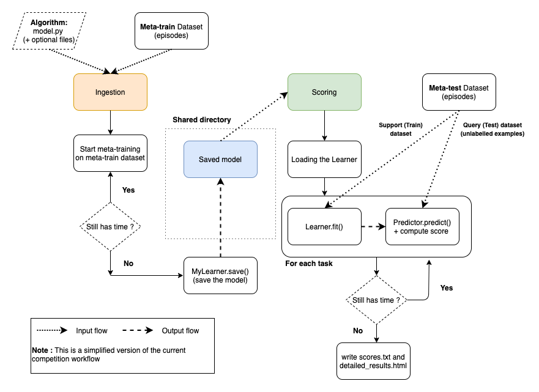

# Few-shot Learning competition starting kit

---
In this document, we present how to setup the tools to use the Jupyter Notebook tutorial. Also we present an overview of the challenge to understand how to write a valid code submission.

In this `README.md` file, you can find the following things : 
* Instructions to setup the environment to make the jupyter notebook ready to use
* An overview of the competition workflow  

In the **Jupyter Notebook** `tutorial.ipynb` you will learn the following things : 
* The format in which the data arrive to the meta-learning algorithm
* Familiarize with the challenge API and more specifically how to organize your code to write a valid submission.
---

<u>**Outline**</u>
* [Setup](#setup)
* [Understand how a submission is evaluated](#understand-how-a-submission-is-evaluated)
* [Prepare a ZIP file for submission on CodaLab](#prepare-a-zip-file-for-submission-on-codalab)
* [Troubleshooting](#troubleshooting)
* [Report bugs and create issues](#report-bugs-and-create-issues)
* [Contact us](#contact-us)

## Setup

### Download the starting kit
You should clone the whole **metadl** repository first by running the following command in the empty root directory of your project :
```
git clone https://github.com/ebadrian/metadl
```
We provide 2 ways of installing the necessary dependencies :
* [via Conda environment](#set-up-the-environment-with-anaconda)
* [via Docker environment](#set-up-the-environment-with-docker)

You can choose your preferred option and directly jump into the corresponding section.
### Set up the environment with Anaconda

**Note** : We assume that you have already installed anaconda on your device. If it's not the case, please check out the right installation guide for your machine in the following link : [conda installation guide](https://docs.conda.io/projects/conda/en/latest/user-guide/install/).

A script `quick_start.sh` is available and allows to quickly set up a conda environment with all the required modules/packages installed. 
Make sure you have cloned the metadl repository beforehand. 

Your root directory should look like the following : 
```
<root_directory>
|   metadl
```

Then, set your current working directory to be in metadl's starting kit folder using the following command :
```bash
cd metadl/starting_kit/
```

Then you can run the `quick_start.sh` script :
```bash
bash quick_start.sh
```
This script creates a Python 3.7 conda environment named **metadl**, install all packages/modules required, and notebook.
**Note**: During the execution, the terminal will ask you to confirm the installation of packages, make sure you accept.

Once everything is installed, you can now activate your environment with this command : 
```bash
conda activate metadl
```
And launch Jupyter notebook the following way : 

```bash
jupyter-notebook
```
You will access the Jupyter menu, click on `tutorial.ipynb` and you are all set.
### Set up the environment with Docker
First, make sure you cloned the GitHub repository.
Then, download the Public data, that is, the **Omniglot** dataset : 
```bash
wget -c https://competitions.codalab.org/my/datasets/download/57327142-2155-4b37-9ee7-74820f56c812 -O omniglot.zip
```
Finally, unzip it : 
```bash
unzip omniglot.zip
```

---

If you are new to docker, install docker from https://docs.docker.com/get-started/.
The following docker image is available to run local tests on your machine. It essentially setups the necessary packages and the Python environment for the competition.
This command will create a container and run the docker image :
```bash
docker run -it -v "$(pwd):/app/codalab" -p 8888:8888 ebadrian/metadl:gpu-latest
```
The option `-v "$(pwd):/app/codalab"` mounts current directory (`starting_kit/`) as `/app/codalab`.
If you want to mount other directories on your disk, please replace $(pwd) by your own directory. The option -p 8888:8888 is useful for running a Jupyter notebook tutorial inside Docker.

The Docker image has python=3.6.9 and has installed packages such as tensorflow=2.3.0 and its associated Keras version, CUDA 10.1, cuDNN 7.6.4, etc. If you want to run local test with Nvidia GPU support, please make sure you have installed nvidia-docker and run instead:
```bash
nvidia-docker run -it -v "$(pwd):/app/codalab" -p 8888:8888 ebadrian/metadl:gpu-latest
```
Make sure you use enough RAM (at least 4GB). If the port 8888 is occupied, you can use other ports, e.g. 8899, and use instead the option `-p 8899:8888`.

#### Run the tutorial notebook
We provide a tutorial in the form of a Jupyter notebook. When you are in your docker container, enter:

```bash
jupyter-notebook --ip=0.0.0.0 --allow-root &
```
Then copy and paste the URL containing your token. It should look like something like that:

```bash
http://0.0.0.0:8888/?token=82e416e792c8f6a9f2194d2f4dbbd3660ad4ca29a4c58fe7
```
and select `metadl/starting_kit/tutorial.ipynb` in the menu.

### Update the starting kit

As new features and possible bug fixes will be constantly added to this starting kit, 
you are invited to get the latest updates before each usage by running:

```
cd <path_to_local_metadl>
git pull
```

If you forked the repository, here is how you update it : [syncing your fork](https://help.github.com/en/articles/syncing-a-fork)
### Public dataset
We provide a public dataset for participants. They can use it to :
* Explore data
* Do local test of their own algorithm

If you followed any of the 2 installation methods, you should already have a new directory that contains the competition public data. This data is the Omniglot dataset that is divided into 2 file :
```
metadl
meta-dataset
omniglot
│   meta_train
│    │ 
│    │    0.tfrecords
│    │    1.tfrecords
│    │    ...
│    │    dataset_spec.json
│
│   meta_test 
│    │   
│    │    864.tfrecords
│    │    ...
│    │    dataset_spec.json

```
* omniglot/meta_train : Contains the classes and examples associated to the **meta-train dataset**
* omniglot/meta_test : Contains the classes and examples associated to the **meta-test dataset**

If you created your environment on your own, you can download the public data from the competition dashboard : 
[Public data](https://competitions.codalab.org/my/datasets/download/57327142-2155-4b37-9ee7-74820f56c812)


## Understand how a submission is evaluated 
First let's describe what scripts a partcipant should write to create a submission. They need to create the following files : 
* **model.py** (mandatory): contains the meta-learning algorithm procedure dispatched into the appropriate classes.

* **model.gin** (Optionnal) : If you are familiar with the [*gin* package](https://github.com/google/gin-config), you can use it to define 
the parameters of your model (e.g. learning rates, etc ...). This file could help organize your submission and keep track of the setups on which you defined you algorithm.
* **config.gin** (Optionnal) : This file allows participants to meta-fit their algorithm on data with a specific **configuration**. Examples are provided in the `tutorial.ipynb`.
* **<any_file.py>** (Optionnal) : Sometimes you would need to create a specfic architecture of a neural net or any helper function for
your meta-learning procedure. You can include all the files you'd like but make sure you import them correctly in **model.py** as it is the only script executed.

An example of a submission using these files is described in the provided Jupyter notebook `tutorial.ipynb`.

The following figure explains the evaluation procedure of the challenge.



## Prepare a ZIP file for submission on CodaLab
Zip the contents of `baselines/zero`(or any folder containing your `model.py` file) without the directory structure:
```bash
cd ../baselines/zero
zip -r mysubmission.zip *
```
**Note** : The command above assumes your current working directory is `starting_kit`.

Then use the "Upload a Submission" button to make a submission to the
competition page on CodaLab platform.

**Tip**: One could run the following command to check the content of a zipped submission folder.
```bash
unzip -l mysubmission.zip
```
## Troubleshooting

* It is highly recommended to use the previous guidelines to prepare a zip file submission instead of simply compressing the code folder in the *Finder* (for MAC users).
* Make sure your submission always writes a file in the Learner's `save()` method. Otherwise, the submission will fail and CodaLab will return the following error during the **scoring** phase : `ModuleNotFoundError: No module named 'model'`.
* Remember that the `run.py` script combines the run of the ingestion and scoring process in one command. If something went wrong in the ingestion process, you will receive this error message : 
    ```code
    from model import MyLearner
    ModuleNotFoundError: No module named 'model'
    ```
    Indeed, the ingestion failed and weren't able to save the submission code (along with your saved Learner) to be accessed in the scoring process. Thus the system can't access the `model.py`. 

## Report bugs and create issues 

If you run into bugs or issues when using this starting kit, please create issues on the [*Issues* page](https://github.com/ebadrian/metadl/issues) of this repo. 

## Contact us 
If you have any questions, please contact us via : 
<metalearningchallenge@googlegroups.com>

